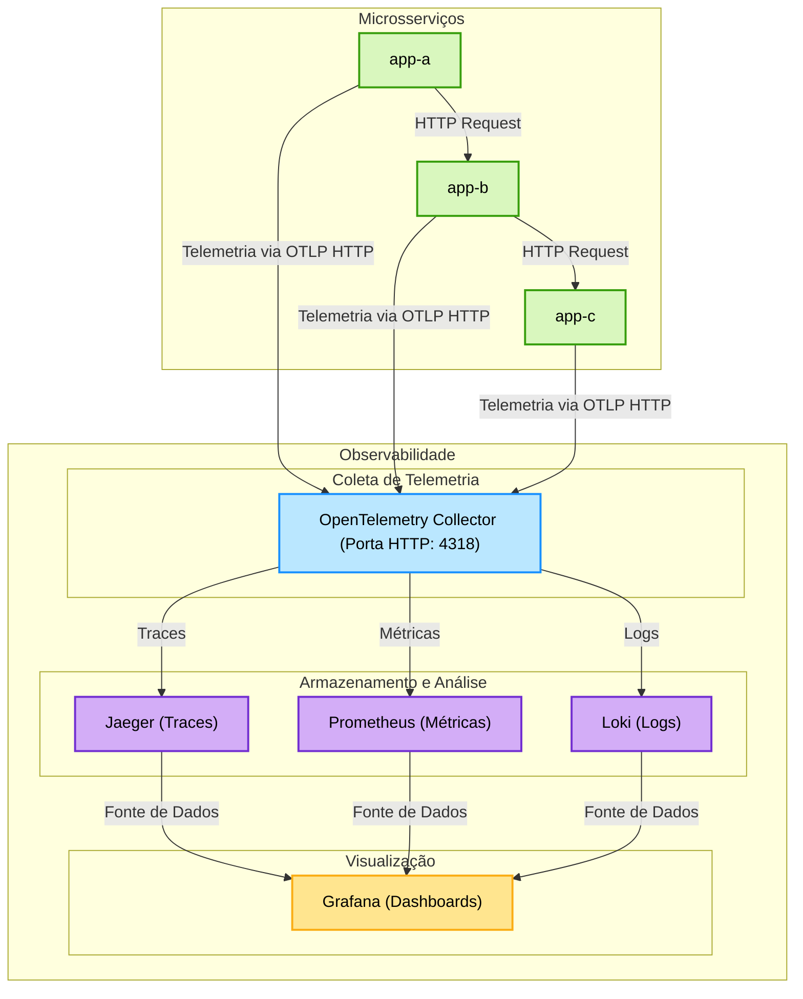
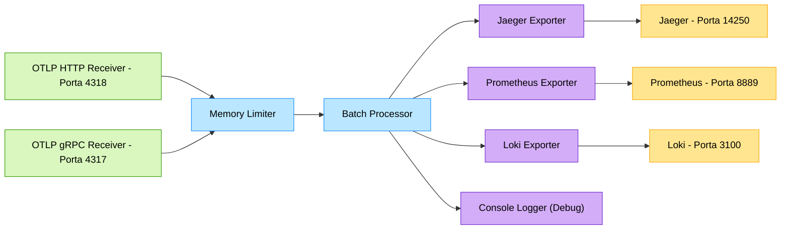

# Aplicação para Exemplo de Telemetria

Este projeto consiste em uma aplicação FastAPI simples projetada para demonstrar a instrumentação com OpenTelemetry em um sistema distribuído. A aplicação simula um ambiente de microsserviços com múltiplos componentes que se comunicam entre si.

## Sobre o Projeto

O projeto inclui:

- Uma API básica construída com FastAPI
- Simulação de latência variável e erros
- Encadeamento de chamadas entre múltiplos serviços
- Configuração completa de Docker e Docker Compose para execução fácil
- Implementação completa dos três pilares da observabilidade:
  - Traces distribuídos com OpenTelemetry e Jaeger
  - Métricas com Prometheus
  - Logs estruturados com Loki
- Visualização unificada através do Grafana

## Estrutura do Projeto

```
.
├── src/
│   ├── app.py                # Aplicação principal FastAPI
│   ├── config.py             # Configurações da aplicação
│   ├── requirements.txt      # Dependências Python
│   ├── Dockerfile           # Instruções para build da imagem Docker
│   └── otel/                # Módulos de telemetria
│       ├── tracing.py       # Configuração de traces
│       ├── metrics.py       # Configuração de métricas
│       └── logs.py          # Configuração de logs
├── k8s/                     # Configurações do Kubernetes
├── .docker/                 # Arquivos de configuração Docker
├── compose.yaml             # Configuração de múltiplos serviços
└── teste_request.http       # Exemplos de requisições HTTP
```

## Pré-requisitos

- Docker
- Docker Compose
- Python 3.8+ (para desenvolvimento local)
- Kubernetes (opcional, para deploy em cluster)

## Como Executar

1. Clone o repositório:

```bash
git clone <url-do-repositorio>
cd <diretorio-do-projeto>
```

2. Inicie o serviço com Docker Compose:

```bash
docker-compose up --build
```

Isso iniciará uma instância da aplicação:
- `app-a` - acessível em http://localhost:8000

## Testando a Aplicação

### Verificar o status do serviço:

```bash
curl http://localhost:8000/
```

Você deverá receber uma resposta como:
```json
{"message": "Esse é o serviço app-a"}
```

### Enviar uma requisição de processamento:

```bash
curl -X POST http://localhost:8000/process \
  -H "Content-Type: application/json" \
  -d '["dado-inicial"]'
```

## Configuração

O arquivo `compose.yaml` está configurado inicialmente para executar apenas o serviço `app-a`. Você pode descomentar as seções dos serviços `app-b` e `app-c`, bem como as variáveis de ambiente adicionais, para criar um ambiente distribuído mais complexo.

```yaml
version: '3.8'

services:
  app-a:
    build: .
    ports:
      - "8000:8000"
    environment:
      - APP_NAME=app-a
      # - APP_URL_DESTINO=http://app-b:8000
      # - APP_ERRORS=5
      # - APP_LATENCY=100
    networks:
      - app-network

  # app-b:
  #   build: .
  #   ports:
  #     - "8001:8000"
  #   environment:
  #     - APP_NAME=app-b
  #     - APP_URL_DESTINO=http://app-c:8000
  #     - APP_ERRORS=10
  #     - APP_LATENCY=150
  #   networks:
  #     - app-network

  # app-c:
  #   build: .
  #   ports:
  #     - "8002:8000"
  #   environment:
  #     - APP_NAME=app-c
  #     - APP_ERRORS=15
  #     - APP_LATENCY=200
  #   networks:
  #     - app-network

networks:
  app-network:
```

### Variáveis de Ambiente

Você pode personalizar o comportamento dos serviços modificando as variáveis de ambiente:

- `APP_NAME`: Nome do serviço
- `APP_URL_DESTINO`: URL para qual o serviço deve propagar a requisição
- `APP_ERRORS`: Porcentagem de requisições que resultarão em erro (0-100)
- `APP_LATENCY`: Latência máxima em milissegundos (atraso aleatório entre 0 e esse valor)

## Endpoints Disponíveis

### Serviço Principal (app-a)

- `GET /`: Health check do serviço
- `GET /metrics`: Endpoint para métricas Prometheus
- `POST /process`: Processa payloads e propaga para outros serviços

### Observabilidade

- Jaeger UI: http://localhost:16686
- Grafana: http://localhost:3000
- Prometheus: http://localhost:9090
- Loki: http://localhost:3100

## Arquitetura do Projeto


## Fluxo dos Dados de Telemetria 


## Implementação de Telemetria

### Traces
- Implementação usando OpenTelemetry
- Propagação de contexto entre serviços
- Atributos personalizados para cada span
- Integração com Jaeger para visualização

### Métricas
- Contadores de requisições
- Medidores de requisições ativas
- Histogramas de tempo de resposta
- Exportação para Prometheus

### Logs
- Logs estruturados com contexto
- Correlação com traces
- Níveis de log configuráveis
- Integração com Loki

